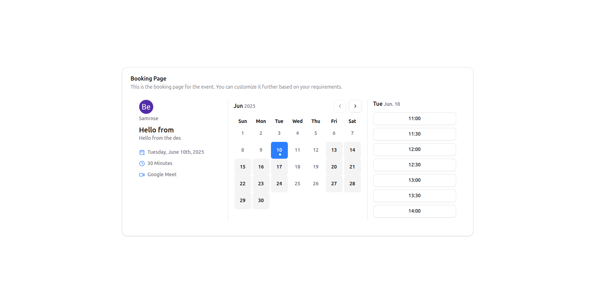

# CalScheduler

A simple calendar scheduling app that allows you to create and manage events with ease.
<br/>
Visit the hosted Url: https://cal.mohammedsamrose.com.np/

 <!-- Add a banner image if you have one -->

## Features

- Google & GitHub authentication (NextAuth.js)
- Create, edit, and manage event types
- Book meetings with custom links
- Availability management
- Responsive UI with Tailwind CSS
- PostgreSQL database (via Prisma ORM)
- Nylas integration for calendar sync
- File uploads (UploadThing)
- Dark mode support

## Tech Stack

- [Next.js](https://nextjs.org/)
- [React](https://react.dev/)
- [Prisma ORM](https://www.prisma.io/)
- [PostgreSQL](https://www.postgresql.org/)
- [Tailwind CSS](https://tailwindcss.com/)
- [NextAuth.js](https://authjs.dev/)
- [Nylas](https://www.nylas.com/)
- [UploadThing](https://uploadthing.com/)
- [Vercel](https://vercel.com/) (deployment)

## Getting Started

### 1. Clone the repository

```sh
git clone https://github.com/samrosemohammed/calendar-scheduling-platform.git
cd calendar-scheduling-platform
```

### 2. Install dependencies

```sh
npm install
```

### 3. Set up environment variables

Copy `.env.example` to `.env` and fill in your credentials:

```sh
cp .env.example .env
```

**Required variables:**

- `DATABASE_URL` and `DIRECT_URL` (Supabse PostgreSQL)
- `AUTH_GOOGLE_ID` and `AUTH_GOOGLE_SECRET`
- `AUTH_GITHUB_ID` and `AUTH_GITHUB_SECRET`
- `AUTH_SECRET`
- `NYLAS_API_KEY`, `NYLAS_API_URI`, `NYLAS_CLIENT_ID`
- `NEXT_PUBLIC_URL`
- `UPLOADTHING_TOKEN`
- `AUTH_TRUST_HOST=true`

### 4. Set up the database

Run Prisma:

```sh
npx prisma stduio
```

Generate Prisma client:

```sh
npx prisma generate
```

```sh
npx prisma db push
```

### 5. Start the development server

```sh
npm run dev
```

Visit [http://localhost:3000](http://localhost:3000) in your browser.

## Deployment

This project is ready to deploy on [Vercel](https://vercel.com/):

- Push your code to GitHub
- Connect your repo on Vercel
- Set all environment variables in the Vercel dashboard
- Deploy!

**Production database migrations:**

```sh
npx prisma migrate deploy
```

## Folder Structure

```
app/
  components/
  dashboard/
  onboarding/
  (bookingPage)/
  api/
  ...
prisma/
  schema.prisma
public/
  ...
```

**Made by [MD Samrose](https://github.com/samrosemohammed)**
